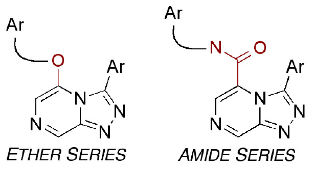
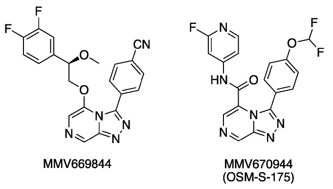
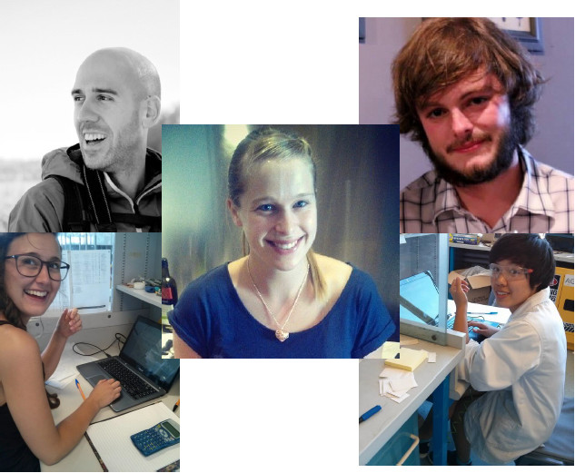
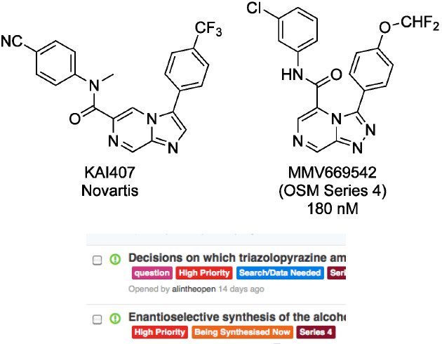

## Synthetic Targets

The main current synthetic focus is on [OSM Series 4](https://openwetware.org/wiki/OpenSourceMalaria:Triazolopyrazine_(TP)_Series) (the triazolopyrazines). Much of the SAR of this series is known, given that it was explored by MMV and Pfizer, but there are active community consultations on both the [ether](http://malaria.ourexperiment.org/the_osm_blog/9601) and [amide](http://malaria.ourexperiment.org/the_osm_blog/9519) sub-series to determine which compounds should be made next – please take a look and suggest possible compounds to be made. 

## Synthetic News

The synthetic chemistry for Series 4 has recently been the focus of extensive community collaboration, giving robust routes to both ethers and amides (summary here). The starting material for the amide series can now be accessed by two different approaches. One approach was developed by Patrick Thomson and Eduvie Omene in Edinburgh, and Inga Topolnicki and Tom Macdonald in Sydney and the other by Sabin Minguez in Stockholm. An interesting oxidative cyclisation that Alice Williamson, Jo Ubels and Tom have been working on is now working nicely to give the triazolopyrazine core and Jo and Tom have solved ether and amide bond formations.  

## Biology News

It had been shown previously that one member of Series 4 (MMV639565) had displayed excellent parasite clearance in vivo, and this has now been seen with another member (MMV669844) suggesting this is a general property of the series. This latter compound and an amide (MMV670944) analog showed hERG activity, requiring this to be addressed in analog design – please suggest ways to do this if this is an area of your expertise. New compounds will be evaluated for PfATP4 activity in Kiaran Kirk’s lab at the ANU. The series shows low metabolic stability; are there groups interested in investigating the possible cause of this and suggesting potential solutions?  

## New Faces

There is an up-to-date list of contributors to OSM on the Landing Page, and it’s important that everyone is acknowledged. If you’ve contributed, but are not featured, please send in a picture. Recent contributors have included Jo Ubels and Tom Macdonald (both starting Honours in Sydney), Inga Topolnicki and Carmen Tran (Sydney summer students), Eduvie Omene and Devon Scott in Edinburgh, Sabin Llona-Minguez from the Helleday Laboratory at the Karolinska Institute and Karsten Klein who has been working on visualisation of compounds. g  

## Informatics News

* Compounds that are evaluated biologically are submitted to ChEMBL, and the project started an in---house compound registration system that anyone can use (though it’s not clear yet how to number compounds with unknown ee)
* A possible shared mechanism of action between Series 4 and a Novartis compound KAI407 was shown to be unlikely by Paul Willis and Chris Southan
* Patrick Thomson developed an email summary service for OSM’s prolific use of GitHub (used to track project activity)  

## What’s Currently Needed

This is what the OSM Consortium most urgently needs in April/May 2014:  

1. The most important is compound synthesis. As an open project, anyone can make compounds. A great way for this to happen is to involve cohorts of undergraduate students, as Stefan Debbert of Lawrence University, Wisconsin has already done  
2. Advice is needed on which Series 4 compounds to make next  
3. Oversight by experienced medicinal chemists on the Series 4 strategy – see the Series wiki  
4. Clerical help with adding compounds with inherited MMV codes to the OSM system - here  
5. Updating of the chemistry and biology on the Series 4 wiki (good for non-lab based people)
6. Help from existing participants in completing the first OSM paper (more on this very soon)  
7. Contacts are needed at CROs that may be interested in synthesising gram-scale amounts of key intermediates or starting materials, free of charge
8. Groups interested in investigating/addressing the cause of the low metabolic stability of Series 4  
9. Contacts at academic/industrial groups possessing compounds structurally similar to those in OSM Series 4  
10. Keep an eye out for World Malaria Day on April 25th – maybe you can ‘net a collaborator’ for OSM!  

## Recent Press About OSM

There was an article in The Saturday Paper about OSM and the project was featured in International Innovation’s Parasites of Poverty issue along with friends from MMV and WHO. Mat Todd featured in a video about the importance of open access that was made following OSM receiving a Wellcome Trust/Google/PLoS ASAP award last year (OSM’s traffic spiked after this was tweeted by Bill Gates).  

## About OSM and How to Join  
 Open Source Malaria (OSM) aims to discover new medicines for the treatment of malaria using an open source model. All data and ideas are freely shared and anyone may participate. OSM is funded by the Australian Government with the Medicines for Malaria Venture, who also provide scientific leadership. Visit the main landing page (opensourcemalaria.org) to follow news about the project, the latest scientific developments and alerts about what OSM currently needs and ways your research could add to the consortium’s activities. 
